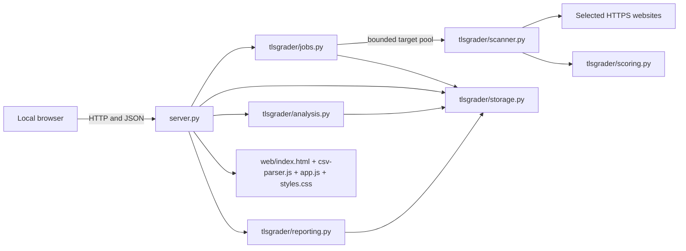

# CIPHERLINE Code Explanation Manual

## 1. Purpose

This manual explains the complete local application: what every source file does, how the files communicate, and what every Python and JavaScript function parameter means.

The application is deliberately dependency-light:

- Python performs TLS networking, certificate parsing, scoring, statistics, storage, exports, and the local HTTP API.
- HTML defines the five application pages.
- CSS controls the Apple-inspired material hierarchy, feedback, accessibility,
  motion preferences, and responsive behaviour.
- JavaScript loads local API data and renders the interactive interface.
- SQLite stores scans, background jobs, and small settings.

## 2. Architecture

Main data flow:

1. The browser uploads or parses a CSV locally.
2. `app.js` sends target objects to `server.py`.
3. `server.py` asks `JobManager` to create a job.
4. `JobManager` assesses up to two targets concurrently by default, while one
   coordinator checkpoints completed results in original input order.
5. `scan_target()` collects certificate, protocol, cipher, revocation, and key-exchange evidence.
6. `score_scan()` converts evidence into component scores, an overall score, a grade, findings, and remediation.
7. `Storage.save_scan()` writes the complete JSON result and searchable columns to SQLite.
8. The browser requests scans, jobs, and analysis from the API.
9. `analyse()` deduplicates records, builds summaries, runs permutation tests, calculates effect sizes, and bootstraps confidence intervals.
10. `reporting.py` creates downloadable CSV and standalone HTML output.

## 3. Root-level files

### `run_local.bat`

Windows double-click entry point. It keeps a visible terminal open, prepares the environment if required, starts `server.py`, and makes startup errors visible.

### `run_local.ps1`

PowerShell startup equivalent. It verifies CPython 3.11-3.13, creates `.venv` when
needed, checks the exact `cryptography` pin, installs only when mismatched, protects
an active job from restart, and starts the loopback service. `-InstallOnly` verifies
the environment; `-NoBrowser` suppresses automatic browser opening.

### `server.py`

Owns the local web server, API routes, static-file delivery, response security headers, request validation, and application startup.

- `_is_loopback(host)`
  - Accepts `localhost` or a literal loopback IP address. Non-loopback server
    mode is intentionally unsupported.

#### `LocalApp`

Container for process-wide services.

- `__init__(database_path, recover=True)`
  - `database_path`: `Path` pointing to the SQLite database.
  - `recover`: whether to mark abandoned jobs interrupted on construction.
  - Creates `Storage`, marks abandoned running jobs as interrupted, creates
    `JobManager`, and creates the locked in-memory analysis cache.

- `get_analysis(compare_field="", group_a="", group_b="", strata=None)`
  - Uses the database revision plus the exact user selection as a cache key.
  - On a cache hit, returns the existing analysis without reading full scan JSON or
    rerunning permutation/bootstrap calculations.
  - An explicit empty `strata` tuple remains empty; it is not converted into an
    automatic all-strata selection.

- `shutdown()`
  - Stops the `JobManager`; the server factory owns when this lifecycle hook runs.

#### `AppServer`

`ThreadingHTTPServer` subclass holding the explicit `LocalApp`, loopback bind host,
and local-only marker. `__init__(address, handler, app, bind_host)` wires those
values without global application state; the per-process CSRF token belongs to
`LocalApp`.

#### `Handler`

Subclass of `BaseHTTPRequestHandler`. One instance handles one HTTP connection.

- `log_message(format, *args)`
  - `format`: standard library HTTP log format string.
  - `args`: values inserted into that format.
  - Prints a timestamped local request log.

- `_headers(status, content_type, length, attachment="")`
  - `status`: HTTP status code.
  - `content_type`: response MIME type.
  - `length`: exact byte length.
  - `attachment`: optional download filename.
  - Sends cache, content-type, frame, referrer, and Content Security Policy headers.

- `_bytes(body, content_type, status=200, attachment="")`
  - `body`: already encoded response bytes.
  - `content_type`: MIME type.
  - `status`: HTTP status, default 200.
  - `attachment`: optional filename.
  - Sends headers and writes bytes to the client.

- `_json(data, status=200)`
  - `data`: JSON-serialisable Python value.
  - `status`: HTTP status.
  - Serialises with `json_dumps()` and returns UTF-8 JSON.

- `_error(status, message)`
  - `status`: error HTTP status.
  - `code`: stable machine-readable code.
  - `message`: safe user-facing description.
  - `diagnostic`: optional internal detail retained only where the API contract
    permits it.
  - Returns a consistent JSON error object.

- `_allowed_host()`
  - Parses the request authority defensively and accepts only a loopback hostname
    or address; control characters, user information, and path syntax are refused.

- `_validate_request(mutating=False)`
  - Enforces Host for every request. Mutations additionally require a same-origin
    or absent Origin, JSON content type, and `X-CSRF-Token` from `/api/health`.

- `_body()`
  - No arguments.
  - Reads a maximum 20 MB request body, treats an empty body as an empty object,
    otherwise requires JSON object syntax, and returns a dictionary.

- `do_GET()`
  - No explicit arguments; uses the current request.
  - Implements:
    - `/api/health`
    - `/api/capabilities`
    - `/api/scans`
    - `/api/scans/{id}`
    - `/api/jobs`
    - `/api/jobs/{id}`
    - `/api/analysis`
    - `/api/export.csv`
    - `/api/export.html`
    - static files and SPA fallback.

- `do_POST()`
  - Implements:
    - `/api/scan` for one target;
    - `/api/jobs` for a target array;
    - `/api/jobs/{id}/cancel` and `/api/jobs/{id}/resume`;
    - `/api/data/clear` for confirmed full reset.
  - Every submitted scan uses the complete assessment.

- `do_DELETE()`
  - Implements `/api/scans/{id}` for deleting one evidence record.

- `_serve_static(path)`
  - `path`: requested URL path.
  - Resolves only files inside `web/`, blocks path traversal, assigns MIME type, and serves `index.html` as the SPA fallback.

- `create_app(database_path, recover=False)`
  - Explicit test/application factory. Importing `server.py` never opens the
    production database.

- `create_server(database_path, host="127.0.0.1", port=8843, auth_token=None, allowed_hosts=None, recover=False)`
  - Creates both the isolated app and loopback HTTP server. `database_path` selects
    SQLite; `host` and `port` define the listener; `recover` controls interrupted
    job recovery. The old compatibility keywords do not enable remote access; a
    non-loopback host is rejected.

- `main()`
  - Parses loopback host, port, database, and browser-opening options, constructs
    factories explicitly, and guarantees application shutdown.

## 4. Python package

### `tlsgrader/__init__.py`

Contains the package description and `__version__`. The health API and startup message read this version.

### `tlsgrader/utils.py`

Shared validation and serialisation helpers.

- `CURRENT_ASSESSMENT_VERSION` and `CURRENT_EVIDENCE_SCHEMA_VERSION`
  - Define the only assessment/schema pair eligible for current analysis.

- `is_current_methodology(value)`
  - `value`: scan/evidence dictionary.
  - Returns true only when both version fields match the complete current contract.

- `utc_now_iso()`
  - Returns the current UTC time as a microsecond-resolution ISO 8601 string.
  - Microseconds make rapid rescans deterministic when newest observations are
    deduplicated.

- `normalize_host(value)`
  - `value`: hostname, IP address, or URL entered by the user.
  - Removes scheme, path, brackets, and trailing dot.
  - Converts international domain names to IDNA ASCII.
  - Rejects invalid or empty hosts.

- `safe_port(value)`
  - `value`: value convertible to integer.
  - Returns an integer from 1 through 65535 or raises `ValueError`.

- `clamp(value, low=0.0, high=100.0)`
  - `value`: number to constrain.
  - `low`: minimum.
  - `high`: maximum.
  - Used to keep scores in the 0-100 interval.

- `json_dumps(value)`
  - `value`: any serialisable object.
  - Produces compact UTF-8-friendly JSON and converts unsupported values with `str`.

- `ensure_directories(root)`
  - `root`: project root `Path`.
  - Ensures `data`, `exports`, and `logs` exist.

### `tlsgrader/scanner.py`

Collects all technical TLS evidence. Private functions begin with `_`; they are implementation details but are documented because they are important for the project defence.

Constants:

- `ASSESSMENT_VERSION`, `EVIDENCE_SCHEMA_VERSION`, and
  `SCANNER_METHOD_VERSION` identify methodology 2.3 records and prevent silent
  comparison with older evidence.
- `PROTOCOL_VERSIONS` maps display names to Python `ssl.TLSVersion` attributes.

- `_notify(callback, message, percent)`
  - `callback`: optional progress callback.
  - `message`: human-readable stage.
  - `percent`: stage completion percentage.
  - Calls the callback only when supplied.

- `_remaining(deadline, fallback)`
  - `deadline`: optional absolute `time.monotonic()` deadline.
  - `fallback`: maximum operation timeout when the deadline has more time left.
  - Returns the smaller positive budget or raises `TimeoutError` after expiry.

- `_getaddrinfo_with_budget(host, port, deadline, cancel)`
  - Resolves in a daemon worker so a blocked operating-system resolver cannot
    hold the assessment caller past its deadline.
  - `cancel`: optional zero-argument callback returning a cancellation Boolean.

- `_read_response_body(response, max_bytes, deadline, cancel, sock=None)`
  - Reads in bounded chunks, resets the socket timeout to the remaining budget,
    honours cancellation, and rejects an oversized revocation response.

- `_PinnedHTTPConnection(hostname, pinned_ip, port, timeout, deadline, cancel)` and
  `_PinnedHTTPSConnection(hostname, pinned_ip, port, timeout, deadline, cancel)`
  - Connect to the previously validated numeric address instead of re-resolving
    at connection time.
  - HTTPS still uses `hostname` for SNI and certificate identity verification;
    connect and TLS-handshake phases recompute the shared remaining deadline.

- `_http_request_pinned(...)`
  - Performs one HTTP(S) request to one validated address.
  - Parameters specify scheme, original hostname, fixed peer IP, port, path,
    method, optional body/headers, timeout, shared deadline/cancel callback, and
    maximum response size.
  - Returns `(status, lower_case_headers, body)` and always closes the socket.

- `_safe_http_fetch(url, timeout, deadline=None, cancel=None, method="GET", body=None, headers=None, max_bytes=2000000, max_redirects=3)`
  - Fetches OCSP/CRL data without trusting a certificate-controlled URL.
  - Every redirect is resolved again; every returned address must be globally
    routable; credentials and unsafe POST redirects are refused; the request is
    pinned to a validated address while preserving HTTP Host and HTTPS SNI.
  - Returns `(response_bytes, final_url)`.

- `locate_openssl()`
  - Checks `OPENSSL_BINARY`, the system path, Git for Windows, common Windows installation paths, and common Unix paths.
  - Returns the executable path or `None`.

- `scanner_capabilities()`
  - Reports OpenSSL availability/version, supported protocol probes, raw SSL support, revocation methods, and cipher-enumeration capability.

- `_connect(host, port, timeout, verify, minimum=None, maximum=None, cipher=None, server_hostname=None)`
  - `host`: normalised hostname.
  - `port`: TCP port.
  - `timeout`: socket timeout in seconds.
  - `verify`: whether CA and hostname validation are mandatory.
  - `minimum`: optional minimum `ssl.TLSVersion`.
  - `maximum`: optional maximum `ssl.TLSVersion`.
  - `cipher`: optional single pre-TLS-1.3 cipher name.
  - `server_hostname`: original hostname used for SNI when `host` is a fixed IP.
  - Returns the wrapped TLS socket and underlying socket.

- `_basic_handshake(host, port, timeout, verify, server_hostname=None)`
  - Performs one standard TLS handshake.
  - Returns negotiated protocol, cipher, cipher bits, peer certificate, ALPN, compression, or error information.

- `_openssl_endpoint(host, port)`
  - Formats IPv4/hostname and bracketed IPv6 endpoints for command-line OpenSSL.

- `_x509_names(name)`
  - `name`: `cryptography.x509.Name`.
  - Converts certificate subject/issuer attributes into readable text.

- `_extension(cert, oid)`
  - `cert`: parsed certificate.
  - `oid`: extension object identifier.
  - Returns the extension value or `None`.

- `_certificate_details(der, trust_valid, trust_error)`
  - `der`: leaf certificate bytes in DER format.
  - `trust_valid`: result of trusted handshake.
  - `trust_error`: trust failure text.
  - Extracts identity, SANs, validity, fingerprints, signature, public key, AIA, OCSP, CRL, and CT evidence.
  - Returns the evidence dictionary and parsed certificate object.

- `_hostname_matches(host, cert)`
  - `host`: requested hostname/IP.
  - `cert`: parsed certificate.
  - Checks SAN first, then CN fallback, including restricted wildcard handling.
  - Returns `(match_result, error_message)`.

- `dns_matches(pattern, requested)` inside `_hostname_matches`
  - `pattern`: certificate DNS pattern.
  - `requested`: requested hostname.
  - Permits only a complete left-most-label wildcard.

- `_run_openssl_s_client(host, port, timeout, server_hostname=None)`
  - Runs `openssl s_client`.
  - Extracts chain PEM blocks, protocol, cipher, temporary key, OCSP stapling, compression, secure renegotiation, and a bounded raw excerpt.

- `_probe_openssl_protocol(openssl, host, port, timeout, flag, server_hostname=None)`
  - Uses command-line OpenSSL for legacy TLS 1.0/1.1 negotiation.
  - Only a peer protocol-version alert is definitive `unsupported`; local
    provider errors and transport failures remain `error`.

- `_verify_chain_ignoring_time(host, port, timeout, server_hostname=None, deadline=None, cancel=None)`
  - Re-verifies a date-invalid certificate with `-verify_return_error` and
    `-no_check_time` so chain trust remains separate from expiry/not-before.

- `_probe_protocol(host, port, timeout, attribute, server_hostname=None)`
  - `attribute`: Python `ssl.TLSVersion` attribute such as `TLSv1_2`.
  - Forces a single TLS version and returns `supported`, `unsupported`, `error`, or `not_tested`.

- `_ssl3_client_hello(host)`
  - Builds a raw SSL 3.0-compatible ClientHello record with legacy cipher identifiers and SNI when possible.

- `_ssl2_client_hello()`
  - Builds a native SSL 2.0 ClientHello with classic three-byte cipher specifications.

- `_raw_legacy_probe(host, port, timeout, payload, classifier, server_hostname=None)`
  - Runs two bounded raw probes and preserves response type, alert, close/reset,
    and error evidence. Repeated post-ClientHello close/reset can be returned as
    lower-confidence `inferred_unsupported`.

- `_probe_ssl3(host, port, timeout, server_hostname=None)`
  - Sends the raw SSL 3.0 ClientHello.
  - Distinguishes SSL 3.0 ServerHello, TLS alert/rejection, connection rejection, timeout, and transport error.
  - Returns `(state, evidence_dictionary)`.

- `_probe_ssl2(host, port, timeout, server_hostname=None)`
  - Sends the native SSL 2.0 ClientHello.
  - Parses SSL 2.0 ServerHello framing.
  - Returns `(state, evidence_dictionary)`.

- `_cipher_metadata(item)`
  - Normalises a local provider cipher record into name, protocol, effective bits,
    symmetric mode, digest, key exchange, and authentication fields. This is what
    makes OpenSSL CBC/static-RSA/anonymous names score correctly.

- `_enumerate_tls12_ciphers(host, port, timeout, server_hostname=None, deadline=None, cancel=None)`
  - Builds every TLS <=1.2 candidate configurable through
    `ALL:eNULL:@SECLEVEL=0` in the local Python provider.
  - Uses iterative elimination: each successful handshake identifies one
    server-selected accepted suite, removes it, and retries the remainder. A
    definitive no-shared-cipher result rejects the remaining set; indeterminate
    failures leave coverage incomplete.
  - After at least one successful selection, two consecutive EOF closures within
    one second for the unchanged remaining set classify that set as
    `inferred_unsupported`. The coverage object records the count, attempts,
    evidence class, and `inferred_not_definitive` confidence. A single EOF,
    timeout/reset, or EOF before any accepted suite remains indeterminate.
  - Returns accepted names, accepted metadata, and a detailed coverage object.

- `_probe_key_exchange_cipher(host, port, timeout, cipher, server_hostname=None)`
  - `cipher`: accepted DHE cipher to force.
  - Uses OpenSSL to capture the temporary key method and bit size.
  - Returns an observation dictionary or `None`.

- `_direct_ocsp(openssl, leaf_pem, issuer_pem, url, timeout, deadline=None, cancel=None)`
  - `openssl`: executable path.
  - `leaf_pem`: leaf certificate PEM.
  - `issuer_pem`: issuer certificate PEM.
  - `url`: certificate OCSP responder URL.
  - `timeout`: network timeout.
  - Builds the OCSP request locally, downloads DER through `_safe_http_fetch`, and
    verifies the saved response offline using `openssl ocsp -respin`.
  - Requires a successful OpenSSL signature/chain result plus a leaf-bound status
    and fresh `thisUpdate`/`nextUpdate` evidence before returning `good`/`revoked`.

- `_check_crl(cert, urls, timeout, issuer_cert=None, deadline=None, cancel=None)`
  - `cert`: leaf certificate.
  - `urls`: CRL distribution URLs.
  - `timeout`: network timeout.
  - Downloads at most two CRLs through `_safe_http_fetch`, parses DER/PEM, verifies
    issuer and signature when the issuer is available, verifies freshness, and
    checks the leaf serial number.

- `_not_scored_scan(...)`
  - Constructs a schema-complete failed, cancelled, or inconclusive observation
    with provenance and empty coverage before passing it through `score_scan()`.

- `scan_target(hostname, port=443, mode="full", timeout=4.0, country="", sector="", source="manual", progress=None, deadline=None, cancel=None)`
  - `hostname`: hostname or URL.
  - `port`: TLS port.
  - `mode`: retained result metadata; forced to `full`.
  - `timeout`: per-operation timeout.
  - `country`: sampling label.
  - `sector`: sampling label.
  - `source`: sampling source description.
  - `progress`: optional `(message, percent)` callback.
  - `deadline`: absolute monotonic reachability deadline supplied by `JobManager`;
    released after the first successful TLS evidence handshake.
  - `cancel`: cooperative cancellation callback.
  - Resolves all addresses under budget, selects the first peer that yields TLS
    evidence, then holds that peer fixed for certificate, OpenSSL, protocol,
    cipher, and key-exchange probes. Returns the scored evidence object.

- `stop_state()` and `bounded_timeout()` inside `scan_target()`
  - Convert pre-handshake deadline failure into `inconclusive`, preserve manual
    cancellation, and continue a reachable assessment with bounded per-operation
    timeouts after releasing the absolute deadline.

### `tlsgrader/scoring.py`

Transforms evidence into explainable scores.

- `finding(severity, code, title, detail, remediation="")`
  - Builds one structured finding.

- `_certificate_score(scan, findings)`
  - `scan`: evidence dictionary.
  - `findings`: shared list to append explanations.
  - Evaluates trust, hostname, dates, revocation, signatures, key sizes, chain completeness, and OCSP stapling.

- `_protocol_score(scan, findings)`
  - Rewards TLS 1.3/1.2 and penalises TLS 1.1, TLS 1.0, SSL 3.0, and SSL 2.0.
  - Treats `error` and `not_tested` as `Not calculated`, removes their risk
    weights from the denominator, and returns a coverage object alongside the
    re-normalised score. If every protocol check is unavailable, the protocol
    component is `None` rather than zero.

- `_key_exchange_score(scan, findings)`
  - Evaluates forward secrecy, static RSA, and the weakest accepted finite-field DHE size.
  - Deducts up to 25 component points in proportion to unclassified accepted-DHE
    candidates and emits `DHE_COVERAGE_PARTIAL`.

- `_cipher_score(scan, findings)`
  - Evaluates weak-name markers, CBC, effective bit strength, TLS compression, and missing cipher evidence.
  - Deducts up to 30 component points in proportion to unclassified TLS 1.2
    candidates and emits `CIPHER_COVERAGE_PARTIAL`.

- `grade_for(score, cap=None)`
  - `score`: numeric overall score.
  - `cap`: optional maximum grade such as D or F.
  - Maps score to A/B/C/D/F and applies the cap.

- `score_scan(scan, weights=None)`
  - `scan`: unscored evidence.
  - `weights`: optional overrides merged with `DEFAULT_WEIGHTS`.
  - Returns `Not scored / N/A` for failed, cancelled, and inconclusive status,
    retaining the collection error as `SCAN_NOT_COMPLETED` rather than inventing
    a score.
  - A reachable methodology-2.3 record remains scored when certificate trust,
    cipher enumeration, or accepted-DHE coverage is incomplete. Unknown trust
    deducts 8 certificate points; cipher and DHE uncertainty use the proportional
    component deductions above. Initial connection failure and manual cancellation
    remain N/A.
  - For completed evidence, calculates all component scores, weighted configuration
    and overall scores, grade caps, ordered findings, and final recommendation.

### `tlsgrader/analysis.py`

Creates descriptive statistics and an entirely user-selected inferential comparison.

Constant:

- `LABEL_FIELDS = ("country", "sector")`: the two metadata columns that can be
  compared. Their values are never allowlisted.

Functions:

- `_mean(values)`, `_median(values)`, `_round(value, digits=2)`
  - Small safe summary helpers.

- `_score(scan)`
  - Reads `scan["scores"]["overall"]` as float.

- `_group_summary(scans)`
  - Calculates n, mean, median, min, max, standard deviation, grade counts, TLS 1.3 rate, legacy-protocol rate, critical-certificate rate, and raw scores.

- `cliffs_delta(group_a, group_b)`
  - `group_a`, `group_b`: score arrays.
  - Calculates non-parametric effect size from all cross-group pairs.

- `_stratified_values(scans, compare_field, group_a, group_b, stratum_field, strata)`
  - Builds reusable numeric Group A/Group B arrays for every selected stratum.
  - Avoids repeatedly filtering and copying full scan dictionaries during resampling.

- `_stratified_difference(grouped)`
  - Calculates each numeric stratum difference and averages strata equally.

- `_stratified_permutation_test(grouped, iterations=4000, seed=20260731)`
  - Shuffles scores only within each control stratum and calculates a two-sided p-value.
  - `iterations`: random permutations.
  - `seed`: reproducibility seed.
  - Accepts the prebuilt numeric arrays to reduce repeated-query latency.

- `_bootstrap_stratified_difference(grouped, iterations=2000, seed=20260731)`
  - Resamples within every group-stratum cell.
  - Returns the 2.5th and 97.5th percentile difference.

- `deduplicate_newest(scans)`
  - Sorts by scan timestamp and then stable scan ID, keeping one record for each
    normalised hostname/port pair. Sharing this helper keeps Analysis and HTML
    inclusion identical even when two observations have the same timestamp.

- `_labels(scans, field)`
  - Discovers, trims, deduplicates, and case-insensitively sorts arbitrary stored labels.

- `analyse(scans, compare_field="", group_a="", group_b="", strata=None)`
  - `scans`: iterable of stored scan objects.
  - `compare_field`: either `country`, `sector`, or blank for no comparison.
  - `group_a`, `group_b`: two distinct discovered values from `compare_field`.
  - `strata`: selected values from the opposite field. `None` means all available;
    an explicit empty iterable means none and returns `awaiting_strata`.
  - Includes all completed scans in `overall_summary`, including hostname-only
    records without labels, while labels/combinations contain only non-empty metadata.
  - Returns discovered labels/combinations even when nothing is selected.
  - Comparing countries controls for sectors; comparing sectors controls for countries.
  - Requires two observations per selected group-stratum cell to calculate and ten
    per cell to mark the result stable.
  - Admits only completed, numeric methodology-2.3 observations, then deduplicates
    by hostname/port. It also returns legacy/duplicate/unlabelled counts, dynamic
    labels/combinations, cell counts, selected cards, finding totals, and explicit
    comparison states (`awaiting_selection`, `awaiting_strata`,
    `insufficient_data`, `preliminary`, `significant`, `not_significant`).

### `tlsgrader/storage.py`

SQLite persistence layer.

- `Storage.__init__(database_path)`
  - Stores the path, creates its parent, creates a write lock, and initialises the schema.

- `connect()`
  - Context manager returning a row-enabled SQLite connection.
  - Enables WAL and foreign keys, commits success, rolls back exceptions.

- `initialize()`
  - Creates `scans`, `jobs`, and `settings`, plus useful indexes, then runs
    `PRAGMA optimize`.

- `_decorate_scan(data)`
  - Adds `methodology_status` (`current` or `legacy_methodology`) without altering
    the stored evidence JSON.

- `_bump_analysis_revision(connection)` / `analysis_revision()`
  - Maintains a monotonic database revision in the `metadata` table.
  - Lets the server invalidate analysis cache entries without hashing or loading
    every full JSON record.

- `save_scan(result)`
  - `result`: complete scored scan dictionary.
  - Adds an ID when missing, stores searchable columns, and stores the full JSON evidence.

- `list_scans(limit=500, country="", sector="", search="")`
  - `limit`: maximum rows; zero means unlimited.
  - `country`, `sector`: exact filters.
  - `search`: hostname substring filter.
  - Returns newest first.

- `list_scan_summaries(limit=50, offset=0, country="", sector="", search="")`
  - Uses only indexed/scalar columns for the Evidence table and never parses full
    `data_json`.
  - Returns page rows, total count, current offset/limit, and arbitrary available
    country/sector labels discovered across the complete dataset.

- `get_scan(scan_id)`
  - Returns one full JSON record or `None`.

- `delete_scan(scan_id)`
  - Deletes one row and returns whether it existed.

- `clear_scans()`
  - Deletes all scan rows.

- `reset_all()`
  - Atomically counts and deletes scans, jobs, and settings.

- `recover_interrupted_jobs()`
  - Marks queued, running, and cancelling jobs interrupted/resumable after process
    restart while preserving their durable `next_index` checkpoint.

- `create_job(payload, total)`
  - `payload`: target list and timeout.
  - `total`: number of targets.
  - Creates a queued job and returns its UUID.

- `update_job(job_id, **changes)`
  - `job_id`: job UUID.
  - `changes`: allow-listed status/progress fields.
  - Updates timestamp automatically.

- `get_job(job_id)`
  - Returns decoded payload, result IDs, and calculated percent.

- `list_jobs(limit=20)`
  - Returns newest job summaries.

- `set_setting(key, value)` / `get_setting(key, default=None)`
  - Generic JSON settings storage. Currently reserved for future local preferences.

### `tlsgrader/jobs.py`

Background queue and batch isolation.

- `JobManager.__init__(storage, workers=2, target_budget=90.0)`
  - `storage`: shared `Storage`.
  - `workers`: per-target thread count constrained to 1-4; default 2.
  - `target_budget`: minimum-two-second total wall-clock budget given to every
    executing target.
  - A separate single-thread coordinator guarantees only one active job.

- `mutation_lock`
  - Property exposing the shared submit/reset lock used by the HTTP API.

- `submit(targets, timeout=5.0)`
  - `targets`: list of dictionaries with hostname/port/country/sector/source.
  - `timeout`: constrained to 2-15 seconds.
  - Normalises every target, refuses overlapping jobs, creates the job row, and schedules `_run`.

- `_schedule(job_id, payload)`
  - Creates the job cancellation event, marks it active, and starts its coordinator.

- `cancel(job_id)` / `resume(job_id)`
  - `cancel` atomically marks an active job `cancelling` and signals every in-flight
    target.
  - `resume` accepts only a durable cancelled/interrupted job and restarts from its
    stored checkpoint when no other job is active.

- `_failure(host, target, diagnostic)`
  - Converts an unexpected scanner exception into schema-2 N/A audit evidence.

- `_scan_kwargs(target, payload, progress, event)`
  - Builds the scanner arguments, including an execution-time deadline and the
    cooperative cancellation callback. Signature inspection keeps test doubles
    compatible.

- `_assess_target(job_id, zero_index, total, target, payload, event)`
  - Collects one target without persistence and returns result plus stable/diagnostic
    error fields. `zero_index` is input order; `total` drives progress copy.

- `_run(job_id, payload, event)`
  - Maintains a bounded window of target futures. Finished observations may arrive
    out of order, but the coordinator buffers them and saves only the next contiguous
    index.
  - Each durable save advances `next_index`, counters, error fields, and result IDs
    in one ordered sequence. On cancellation it discards uncheckpointed buffered
    results, so resume cannot duplicate or skip targets.
  - Before saving, the coordinator derives the result UUID from `job_id` and the
    original zero-based target index. If the process stops between evidence save
    and checkpoint update, resume replaces the same row and advances once.
  - Produces `completed`, `completed_with_errors`, `cancelled`, or `failed`.

- `active_count()`
  - Returns the in-memory active-job count under lock.

- `shutdown()`
  - Refuses new submissions, signals active work, closes the coordinator executor,
    and waits for bounded shutdown.

### `tlsgrader/reporting.py`

- `_spreadsheet_safe(value)`
  - Prefixes spreadsheet formula-leading text (`=`, `+`, `-`, `@`) with an
    apostrophe to prevent CSV formula injection.

- `_methodology_status(scan)` / `_legacy_state(protocols)`
  - Produce stable current/legacy and supported/not-supported/unknown export states.

- `scans_csv(scans)`
  - `scans`: real scan dictionaries.
  - Produces a spreadsheet-ready CSV including component scores, protocols, SSL 2.0/3.0, legacy status, minimum DHE bits, and minimum cipher bits.

- `report_html(scans, analysis)`
  - `scans`: evidence rows.
  - `analysis`: result from `analyse()`.
  - Creates a self-contained HTML report with no remote fonts or scripts.

- `bars(values)` inside `report_html`
  - `values`: mapping from group name to summary.
  - Generates safe report bar markup.

- `esc(value)`, `inclusion(scan)`, and `report_score(scan, field, fallback="--")`
  inside `report_html()`
  - Escape dynamic content, explain whether a row was included/failed/legacy/older,
    and prevent N/A rows from regaining numeric scores in the report.

## 5. Browser files

### `web/index.html`

Defines five pages:

1. Overview: metrics, discovered label-combination coverage, and recent evidence.
2. Scan lab: single-site form, CSV upload, and job queue.
3. Evidence: filters, exports, result table, and detail dialog.
4. Analysis: no-default comparison builder, dynamic labels/strata, group cards,
   charts, statistics, and findings.
5. Method: workflow, scoring, interpretations, requirement coverage, and reset.

All authored copy is English. HTML entities are used for symbols where useful.

### `web/styles.css`

Defines the neutral/blue visual system, translucent navigation materials, panels,
tables, forms, immediate press/focus feedback, progress indicators, comparison
charts, dialog, responsive breakpoints, CSV confirmation state, and dynamic
comparison builder. Motion is limited to short transform/opacity feedback and has
reduced-motion, reduced-transparency, increased-contrast, and forced-colour modes.

### `web/app.js`

Constants and state:

- `state`: scans, jobs, analysis, exact analysis selection, and current CSV targets.
- `$`, `$$`: single and multiple DOM query helpers.
- `safe(value)`: HTML-escapes dynamic values.
- `number(value, suffix="")`: formats optional numeric values.
- `isScored(scan)`: accepts only completed, numeric assessment-2.3/schema-2
  summaries for score/grade display.
- `date(value)`: forces English Singapore date formatting with `en-SG`.
- `state.pollInFlight`, `state.csrfToken`, and `state.jobFingerprint`: prevent
  overlapping job polls, hold the health-issued mutation token, and avoid
  reloading evidence when only an unchanged job was polled.

Functions:

- `api(path, options={})`
  - `path`: local API path.
  - `options`: fetch method/body/headers.
  - Adds JSON/CSRF headers only to mutations, parses JSON/text, and throws the safe
    user-facing message from a stable API error body.

- `toast(message, error=false)`
  - Creates a temporary local notification.

- `navigate(route)`
  - Activates one page, navigation item, title, and URL hash.

- `showDataError(error)`
  - Deduplicates repeated refresh failures for ten seconds and presents one safe
    error toast instead of a false success message.

- `analysisQuery()`
  - Serialises `compare_field`, `group_a`, `group_b`, and repeated selected
    `stratum` parameters.

- `updateExportLinks()`
  - Applies the current user-selected comparison to CSV and HTML export URLs.

- `refreshHealth()`
  - Loads version and scanner capabilities.

- `refreshScans()`
  - Loads one server-filtered summary page, corrects an out-of-range page after
    deletion/filtering, and redraws Evidence plus pagination.

- `scanQuery()`
  - Serialises search, country, sector, 50-row limit, and page offset.

- `refreshRecent()`
  - Loads only five newest summary rows for the Overview.

- `refreshAnalysis()`
  - Loads analysis for the exact current selection and redraws Analysis/Overview.

- `refreshAll()`
  - Refreshes health, scans, jobs, then analysis.

- `renderOverview()`
  - Renders total observations, mean score, TLS 1.3 rate, findings, and every
    discovered country/sector combination without fixed target labels.

- `renderRecent()`
  - Renders five newest records.

- `renderResults()`
  - Renders the server-filtered page and adds a visible, keyboard-accessible
    detailed-results prompt to every row.

- `renderPagination()`
  - Updates page range and previous/next disabled state from API total/offset/limit.

- `refreshJobs()` / `renderJobs()`
  - Loads and renders task status, progress, stable errors, and cancel/resume actions.

- `jobMessage(job)` / `changeJobState(jobId, action, button)`
  - Builds safe job-card copy and sends cancel/resume mutations while disabling the
    pressed control.

- `renderAnalysis()`
  - Renders the no-default-selection state or the exact selected comparison,
    including group cells, p-value, effect size, confidence interval, and stability.

- `replaceSelectOptions(select, firstLabel, values)`
  - Rebuilds a select from discovered values and preserves a still-valid selection.

- `updateDataLabelControls()`
  - Uses Analysis-discovered arbitrary country/sector values to update the manual
    entry datalists.

- `updateEvidenceFilterControls()`
  - Populates country/sector Evidence filters from full-dataset labels returned by
    the summary API while preserving a still-valid choice.

- `populateComparisonControls()`
  - Populates Group A/B from the chosen CSV-derived field and renders the opposite
    field as dynamic control-stratum checkboxes.

- `valueRows(values)`
  - Converts an object into safe key/value detail markup.

- `openDetail(id)`
  - `id`: scan UUID.
  - Loads and opens complete certificate, protocol, key-exchange, cipher, findings, raw evidence, and metadata.

- `submitSingle(event)`
  - Prevents normal form navigation and submits one full assessment.

- `submitBatch()`
  - Submits parsed CSV targets as one full-assessment job.

- `resetFileSelection()`
  - Clears in-memory and visual CSV state.

- `handleCsvFile(file)`
  - Reads a selected/dropped file, parses targets, calculates group counts, and shows a prominent confirmation.

- `resetProject()`
  - Requires browser confirmation and exact API confirmation before clearing project state.

- `updateCompareField(event)`
  - Clears both groups and all strata after a dimension change so nothing is
    silently selected.

- `updateComparisonGroups()`
  - Reads Group A/B, rejects identical labels, and refreshes the selected analysis.

- `updateAnalysisStrata()`
  - Reads exactly the checked dynamic strata. Zero checked values is allowed and
    produces the explicit `awaiting_strata` state.

- `bindEvents()`
  - Attaches all navigation, form, upload, drag/drop, filter, selector, dialog, and reset handlers.

The final timer refreshes active jobs every 2.5 seconds but remains idle when no job is running.

### `web/csv-parser.js`

UMD-style pure parser loaded before `app.js` in the browser and imported directly
by Node tests. It contains no DOM or network dependency.

- `readRows(text)`
  - Implements a small CSV state machine for quoted commas, escaped quotes,
    embedded CR/LF, row line numbers, blank lines, and unclosed-quote errors.

- `normalizeHeader(value)`
  - Removes BOM, normalises case/spaces, and maps `host`, `domain`, `website`, and
    `url` aliases to `hostname`.

- `validHostnameOrUrl(value)`
  - Accepts only HTTP(S)-style host input, rejects whitespace/invalid domains, and
    aligns domain, IDNA, IPv4, and bracketed-IPv6 behaviour with the backend.

- `targetIdentity(target)`
  - Normalises hostname plus effective TLS port for duplicate detection. URL
    scheme is irrelevant; an omitted port means 443 and an explicit URL port is
    preserved.

- `parseTargetCSV(text)`
  - Detects labelled versus headerless one-column data, validates duplicate or
    unknown headers and row shapes, validates host/port per line, strips fields not
    accepted by the scanner API, and deduplicates equivalent targets.
  - Returns `{targets, invalid, duplicates, ignoredHeaders}` and throws only when
    the file structure or entire valid target set is unusable.

## 6. Verification

The complete Python and browser regression suite is maintained locally and is
intentionally excluded from the repository. It covers scoring boundaries,
controlled TLS endpoints, analysis and reporting, durable jobs and storage,
loopback API security, CSV parsing, and frontend contracts.

## 7. Change checklist

When changing scanner evidence:

1. Update `scanner.py`.
2. Update the matching score or evidence renderer.
3. Update CSV/HTML reporting if the field is submission-relevant.
4. Add a scanner/scoring test.
5. Confirm older JSON records do not crash the UI.

When changing analysis:

1. Update `analysis.py`.
2. Pass any new control through `server.py`.
3. Update `analysisQuery()` and `renderAnalysis()`.
4. Update report wording.
5. Add tests for minimum sample, direction, and selected strata.

When changing the interface:

1. Keep all authored UI strings in English.
2. Keep dates explicitly formatted with `en-SG`.
3. Preserve keyboard-accessible buttons, labels, and dialog close controls.
4. Check mobile breakpoints.
5. Run JavaScript syntax check and the Python regression suite.
