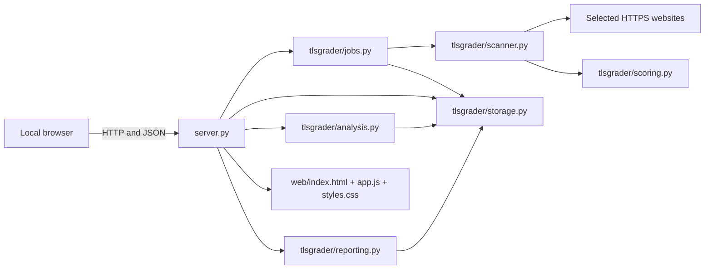

# CIPHERLINE Code Explanation Manual

## 1. Purpose

This manual explains the complete local application: what every source file does, how the files communicate, and what every Python and JavaScript function parameter means.

The application is deliberately dependency-light:

- Python performs TLS networking, certificate parsing, scoring, statistics, storage, exports, and the local HTTP API.
- HTML defines the five application pages.
- CSS controls the Apple-inspired material hierarchy, feedback, accessibility,
  motion preferences, and responsive behaviour.
- JavaScript loads local API data and renders the interactive interface.
- SQLite stores scans, background jobs, and small settings.

## 2. Architecture

Main data flow:

1. The browser uploads or parses a CSV locally.
2. `app.js` sends target objects to `server.py`.
3. `server.py` asks `JobManager` to create a job.
4. `JobManager` calls `scan_target()` for every target.
5. `scan_target()` collects certificate, protocol, cipher, revocation, and key-exchange evidence.
6. `score_scan()` converts evidence into component scores, an overall score, a grade, findings, and remediation.
7. `Storage.save_scan()` writes the complete JSON result and searchable columns to SQLite.
8. The browser requests scans, jobs, and analysis from the API.
9. `analyse()` deduplicates records, builds summaries, runs permutation tests, calculates effect sizes, and bootstraps confidence intervals.
10. `reporting.py` creates downloadable CSV and standalone HTML output.

## 3. Root-level files

### `run_local.bat`

Windows double-click entry point. It keeps a visible terminal open, prepares the environment if required, starts `server.py`, and makes startup errors visible.

### `run_local.ps1`

PowerShell startup equivalent. It is useful from a VS Code terminal or an explicit PowerShell session.

### `server.py`

Owns the local web server, API routes, static-file delivery, response security headers, request validation, and application startup.

#### `LocalApp`

Container for process-wide services.

- `__init__(database_path)`
  - `database_path`: `Path` pointing to the SQLite database.
  - Creates `Storage`, marks abandoned running jobs as interrupted, creates
    `JobManager`, and creates the locked in-memory analysis cache.

- `get_analysis(compare_field="", group_a="", group_b="", strata=None)`
  - Uses the database revision plus the exact user selection as a cache key.
  - On a cache hit, returns the existing analysis without reading full scan JSON or
    rerunning permutation/bootstrap calculations.
  - An explicit empty `strata` tuple remains empty; it is not converted into an
    automatic all-strata selection.

#### `Handler`

Subclass of `BaseHTTPRequestHandler`. One instance handles one HTTP connection.

- `log_message(format, *args)`
  - `format`: standard library HTTP log format string.
  - `args`: values inserted into that format.
  - Prints a timestamped local request log.

- `_headers(status, content_type, length, attachment="")`
  - `status`: HTTP status code.
  - `content_type`: response MIME type.
  - `length`: exact byte length.
  - `attachment`: optional download filename.
  - Sends cache, content-type, frame, referrer, and Content Security Policy headers.

- `_bytes(body, content_type, status=200, attachment="")`
  - `body`: already encoded response bytes.
  - `content_type`: MIME type.
  - `status`: HTTP status, default 200.
  - `attachment`: optional filename.
  - Sends headers and writes bytes to the client.

- `_json(data, status=200)`
  - `data`: JSON-serialisable Python value.
  - `status`: HTTP status.
  - Serialises with `json_dumps()` and returns UTF-8 JSON.

- `_error(status, message)`
  - `status`: error HTTP status.
  - `message`: safe error description.
  - Returns a consistent JSON error object.

- `_body()`
  - No arguments.
  - Reads a maximum 20 MB request body, requires JSON object syntax, and returns a dictionary.

- `do_GET()`
  - No explicit arguments; uses the current request.
  - Implements:
    - `/api/health`
    - `/api/capabilities`
    - `/api/scans`
    - `/api/scans/{id}`
    - `/api/jobs`
    - `/api/jobs/{id}`
    - `/api/analysis`
    - `/api/export.csv`
    - `/api/export.html`
    - static files and SPA fallback.

- `do_POST()`
  - Implements:
    - `/api/scan` for one target;
    - `/api/jobs` for a target array;
    - `/api/data/clear` for confirmed full reset.
  - Every submitted scan uses the complete assessment.

- `do_DELETE()`
  - Implements `/api/scans/{id}` for deleting one evidence record.

- `_serve_static(path)`
  - `path`: requested URL path.
  - Resolves only files inside `web/`, blocks path traversal, assigns MIME type, and serves `index.html` as the SPA fallback.

- `main()`
  - Parses `--host`, `--port`, and browser-opening options.
  - Starts `ThreadingHTTPServer`.
  - Keeps the default bind address at `127.0.0.1`.

## 4. Python package

### `tlsgrader/__init__.py`

Contains the package description and `__version__`. The health API and startup message read this version.

### `tlsgrader/utils.py`

Shared validation and serialisation helpers.

- `utc_now_iso()`
  - Returns the current UTC time as a second-resolution ISO 8601 string.

- `normalize_host(value)`
  - `value`: hostname, IP address, or URL entered by the user.
  - Removes scheme, path, brackets, and trailing dot.
  - Converts international domain names to IDNA ASCII.
  - Rejects invalid or empty hosts.

- `safe_port(value)`
  - `value`: value convertible to integer.
  - Returns an integer from 1 through 65535 or raises `ValueError`.

- `clamp(value, low=0.0, high=100.0)`
  - `value`: number to constrain.
  - `low`: minimum.
  - `high`: maximum.
  - Used to keep scores in the 0-100 interval.

- `json_dumps(value)`
  - `value`: any serialisable object.
  - Produces compact UTF-8-friendly JSON and converts unsupported values with `str`.

- `ensure_directories(root)`
  - `root`: project root `Path`.
  - Ensures `data`, `exports`, and `logs` exist.

### `tlsgrader/scanner.py`

Collects all technical TLS evidence. Private functions begin with `_`; they are implementation details but are documented because they are important for the project defence.

- `_notify(callback, message, percent)`
  - `callback`: optional progress callback.
  - `message`: human-readable stage.
  - `percent`: stage completion percentage.
  - Calls the callback only when supplied.

- `locate_openssl()`
  - Checks `OPENSSL_BINARY`, the system path, Git for Windows, common Windows installation paths, and common Unix paths.
  - Returns the executable path or `None`.

- `scanner_capabilities()`
  - Reports OpenSSL availability/version, supported protocol probes, raw SSL support, revocation methods, and cipher-enumeration capability.

- `_connect(host, port, timeout, verify, minimum=None, maximum=None, cipher=None)`
  - `host`: normalised hostname.
  - `port`: TCP port.
  - `timeout`: socket timeout in seconds.
  - `verify`: whether CA and hostname validation are mandatory.
  - `minimum`: optional minimum `ssl.TLSVersion`.
  - `maximum`: optional maximum `ssl.TLSVersion`.
  - `cipher`: optional single pre-TLS-1.3 cipher name.
  - Returns the wrapped TLS socket and underlying socket.

- `_basic_handshake(host, port, timeout, verify)`
  - Performs one standard TLS handshake.
  - Returns negotiated protocol, cipher, cipher bits, peer certificate, ALPN, compression, or error information.

- `_x509_names(name)`
  - `name`: `cryptography.x509.Name`.
  - Converts certificate subject/issuer attributes into readable text.

- `_extension(cert, oid)`
  - `cert`: parsed certificate.
  - `oid`: extension object identifier.
  - Returns the extension value or `None`.

- `_certificate_details(der, trust_valid, trust_error)`
  - `der`: leaf certificate bytes in DER format.
  - `trust_valid`: result of trusted handshake.
  - `trust_error`: trust failure text.
  - Extracts identity, SANs, validity, fingerprints, signature, public key, AIA, OCSP, CRL, and CT evidence.
  - Returns the evidence dictionary and parsed certificate object.

- `_hostname_matches(host, cert)`
  - `host`: requested hostname/IP.
  - `cert`: parsed certificate.
  - Checks SAN first, then CN fallback, including restricted wildcard handling.
  - Returns `(match_result, error_message)`.

- `dns_matches(pattern, requested)` inside `_hostname_matches`
  - `pattern`: certificate DNS pattern.
  - `requested`: requested hostname.
  - Permits only a complete left-most-label wildcard.

- `_run_openssl_s_client(host, port, timeout)`
  - Runs `openssl s_client`.
  - Extracts chain PEM blocks, protocol, cipher, temporary key, OCSP stapling, compression, secure renegotiation, and a bounded raw excerpt.

- `_probe_protocol(host, port, timeout, attribute)`
  - `attribute`: Python `ssl.TLSVersion` attribute such as `TLSv1_2`.
  - Forces a single TLS version and returns `supported`, `unsupported`, `error`, or `not_tested`.

- `_ssl3_client_hello(host)`
  - Builds a raw SSL 3.0-compatible ClientHello record with legacy cipher identifiers and SNI when possible.

- `_ssl2_client_hello()`
  - Builds a native SSL 2.0 ClientHello with classic three-byte cipher specifications.

- `_probe_ssl3(host, port, timeout)`
  - Sends the raw SSL 3.0 ClientHello.
  - Distinguishes SSL 3.0 ServerHello, TLS alert/rejection, connection rejection, timeout, and transport error.
  - Returns `(state, evidence_dictionary)`.

- `_probe_ssl2(host, port, timeout)`
  - Sends the native SSL 2.0 ClientHello.
  - Parses SSL 2.0 ServerHello framing.
  - Returns `(state, evidence_dictionary)`.

- `_enumerate_tls12_ciphers(host, port, timeout)`
  - Gets all locally supported non-TLS-1.3 cipher candidates.
  - Tries each candidate against the target with TLS 1.2 constraints.
  - Returns accepted names, accepted detail dictionaries, and attempted count.

- `_probe_key_exchange_cipher(host, port, timeout, cipher)`
  - `cipher`: accepted DHE cipher to force.
  - Uses OpenSSL to capture the temporary key method and bit size.
  - Returns an observation dictionary or `None`.

- `_direct_ocsp(openssl, leaf_pem, issuer_pem, url, timeout)`
  - `openssl`: executable path.
  - `leaf_pem`: leaf certificate PEM.
  - `issuer_pem`: issuer certificate PEM.
  - `url`: certificate OCSP responder URL.
  - `timeout`: network timeout.
  - Runs direct OCSP validation in a temporary directory and returns status/detail.

- `_check_crl(cert, urls, timeout)`
  - `cert`: leaf certificate.
  - `urls`: CRL distribution URLs.
  - `timeout`: network timeout.
  - Downloads at most two CRLs with a 2 MB safety limit, parses DER/PEM, and checks the leaf serial number.

- `scan_target(hostname, port=443, mode="full", timeout=4.0, country="", sector="", source="manual", progress=None)`
  - `hostname`: hostname or URL.
  - `port`: TLS port.
  - `mode`: retained result metadata; forced to `full`.
  - `timeout`: per-operation timeout.
  - `country`: sampling label.
  - `sector`: sampling label.
  - `source`: sampling source description.
  - `progress`: optional `(message, percent)` callback.
  - Orchestrates the entire scan and returns the scored evidence object.

### `tlsgrader/scoring.py`

Transforms evidence into explainable scores.

- `finding(severity, code, title, detail, remediation="")`
  - Builds one structured finding.

- `_certificate_score(scan, findings)`
  - `scan`: evidence dictionary.
  - `findings`: shared list to append explanations.
  - Evaluates trust, hostname, dates, revocation, signatures, key sizes, chain completeness, and OCSP stapling.

- `_protocol_score(scan, findings)`
  - Rewards TLS 1.3/1.2 and penalises TLS 1.1, TLS 1.0, SSL 3.0, and SSL 2.0.
  - Records incomplete coverage instead of claiming modern-only support.

- `_key_exchange_score(scan, findings)`
  - Evaluates forward secrecy, static RSA, and the weakest accepted finite-field DHE size.

- `_cipher_score(scan, findings)`
  - Evaluates weak-name markers, CBC, effective bit strength, TLS compression, and missing cipher evidence.

- `grade_for(score, cap=None)`
  - `score`: numeric overall score.
  - `cap`: optional maximum grade such as D or F.
  - Maps score to A/B/C/D/F and applies the cap.

- `score_scan(scan, weights=None)`
  - `scan`: unscored evidence.
  - `weights`: optional overrides merged with `DEFAULT_WEIGHTS`.
  - Returns `Not scored / N/A` immediately when `status == "failed"`, retaining
    the collection error as `SCAN_NOT_COMPLETED` rather than inventing a score.
  - For completed evidence, calculates all component scores, weighted configuration
    and overall scores, grade caps, ordered findings, and final recommendation.

### `tlsgrader/analysis.py`

Creates descriptive statistics and an entirely user-selected inferential comparison.

Constant:

- `LABEL_FIELDS = ("country", "sector")`: the two metadata columns that can be
  compared. Their values are never allowlisted.

Functions:

- `_mean(values)`, `_median(values)`, `_round(value, digits=2)`
  - Small safe summary helpers.

- `_score(scan)`
  - Reads `scan["scores"]["overall"]` as float.

- `_group_summary(scans)`
  - Calculates n, mean, median, min, max, standard deviation, grade counts, TLS 1.3 rate, legacy-protocol rate, critical-certificate rate, and raw scores.

- `cliffs_delta(group_a, group_b)`
  - `group_a`, `group_b`: score arrays.
  - Calculates non-parametric effect size from all cross-group pairs.

- `_stratified_values(scans, compare_field, group_a, group_b, stratum_field, strata)`
  - Builds reusable numeric Group A/Group B arrays for every selected stratum.
  - Avoids repeatedly filtering and copying full scan dictionaries during resampling.

- `_stratified_difference(grouped)`
  - Calculates each numeric stratum difference and averages strata equally.

- `_stratified_permutation_test(grouped, iterations=4000, seed=20260731)`
  - Shuffles scores only within each control stratum and calculates a two-sided p-value.
  - `iterations`: random permutations.
  - `seed`: reproducibility seed.
  - Accepts the prebuilt numeric arrays to reduce repeated-query latency.

- `_bootstrap_stratified_difference(grouped, iterations=2000, seed=20260731)`
  - Resamples within every group-stratum cell.
  - Returns the 2.5th and 97.5th percentile difference.

- `_deduplicate(scans)`
  - Keeps the newest completed record for each normalised hostname/port pair.

- `_labels(scans, field)`
  - Discovers, trims, deduplicates, and case-insensitively sorts arbitrary stored labels.

- `analyse(scans, compare_field="", group_a="", group_b="", strata=None)`
  - `scans`: iterable of stored scan objects.
  - `compare_field`: either `country`, `sector`, or blank for no comparison.
  - `group_a`, `group_b`: two distinct discovered values from `compare_field`.
  - `strata`: selected values from the opposite field. `None` means all available;
    an explicit empty iterable means none and returns `awaiting_strata`.
  - Includes all completed scans in `overall_summary`, including hostname-only
    records without labels, while labels/combinations contain only non-empty metadata.
  - Returns discovered labels/combinations even when nothing is selected.
  - Comparing countries controls for sectors; comparing sectors controls for countries.
  - Requires two observations per selected group-stratum cell to calculate and ten
    per cell to mark the result stable.

### `tlsgrader/storage.py`

SQLite persistence layer.

- `Storage.__init__(database_path)`
  - Stores the path, creates its parent, creates a write lock, and initialises the schema.

- `connect()`
  - Context manager returning a row-enabled SQLite connection.
  - Enables WAL and foreign keys, commits success, rolls back exceptions.

- `initialize()`
  - Creates `scans`, `jobs`, and `settings`, plus useful indexes, then runs
    `PRAGMA optimize`.

- `analysis_revision()`
  - Hashes analysis-relevant scalar columns into a compact revision fingerprint.
  - Lets the server validate its analysis cache without loading every full JSON record.

- `save_scan(result)`
  - `result`: complete scored scan dictionary.
  - Adds an ID when missing, stores searchable columns, and stores the full JSON evidence.

- `list_scans(limit=500, country="", sector="", search="")`
  - `limit`: maximum rows; zero means unlimited.
  - `country`, `sector`: exact filters.
  - `search`: hostname substring filter.
  - Returns newest first.

- `get_scan(scan_id)`
  - Returns one full JSON record or `None`.

- `delete_scan(scan_id)`
  - Deletes one row and returns whether it existed.

- `clear_scans()`
  - Deletes all scan rows.

- `reset_all()`
  - Atomically counts and deletes scans, jobs, and settings.

- `recover_interrupted_jobs()`
  - Marks queued/running jobs interrupted after process restart.

- `create_job(payload, total)`
  - `payload`: target list and timeout.
  - `total`: number of targets.
  - Creates a queued job and returns its UUID.

- `update_job(job_id, **changes)`
  - `job_id`: job UUID.
  - `changes`: allow-listed status/progress fields.
  - Updates timestamp automatically.

- `get_job(job_id)`
  - Returns decoded payload, result IDs, and calculated percent.

- `list_jobs(limit=20)`
  - Returns newest job summaries.

- `set_setting(key, value)` / `get_setting(key, default=None)`
  - Generic JSON settings storage. Currently reserved for future local preferences.

### `tlsgrader/jobs.py`

Background queue and batch isolation.

- `JobManager.__init__(storage, workers=2)`
  - `storage`: shared `Storage`.
  - `workers`: thread count constrained to 1-4.

- `submit(targets, timeout=5.0)`
  - `targets`: list of dictionaries with hostname/port/country/sector/source.
  - `timeout`: constrained to 2-15 seconds.
  - Normalises every target, refuses overlapping jobs, creates the job row, and schedules `_run`.

- `_run(job_id, payload)`
  - Processes targets serially inside the job.
  - Updates per-target progress.
  - Saves failures as evidence instead of aborting the batch.
  - Produces `completed` or `completed_with_errors`.

- `active_count()`
  - Returns the in-memory active-job count under lock.

- `shutdown()`
  - Closes the executor and waits for active work.

### `tlsgrader/reporting.py`

- `scans_csv(scans)`
  - `scans`: real scan dictionaries.
  - Produces a spreadsheet-ready CSV including component scores, protocols, SSL 2.0/3.0, legacy status, minimum DHE bits, and minimum cipher bits.

- `report_html(scans, analysis)`
  - `scans`: evidence rows.
  - `analysis`: result from `analyse()`.
  - Creates a self-contained HTML report with no remote fonts or scripts.

- `bars(values)` inside `report_html`
  - `values`: mapping from group name to summary.
  - Generates safe report bar markup.

## 5. Browser files

### `web/index.html`

Defines five pages:

1. Overview: metrics, discovered label-combination coverage, and recent evidence.
2. Scan lab: single-site form, CSV upload, and job queue.
3. Evidence: filters, exports, result table, and detail dialog.
4. Analysis: no-default comparison builder, dynamic labels/strata, group cards,
   charts, statistics, and findings.
5. Method: workflow, scoring, interpretations, requirement coverage, and reset.

All authored copy is English. HTML entities are used for symbols where useful.

### `web/styles.css`

Defines the neutral/blue visual system, translucent navigation materials, panels,
tables, forms, immediate press/focus feedback, progress indicators, comparison
charts, dialog, responsive breakpoints, CSV confirmation state, and dynamic
comparison builder. Motion is limited to short transform/opacity feedback and has
reduced-motion, reduced-transparency, increased-contrast, and forced-colour modes.

### `web/app.js`

Constants and state:

- `state`: scans, jobs, analysis, exact analysis selection, and current CSV targets.
- `$`, `$$`: single and multiple DOM query helpers.
- `safe(value)`: HTML-escapes dynamic values.
- `number(value, suffix="")`: formats optional numeric values.
- `date(value)`: forces English Singapore date formatting with `en-SG`.

Functions:

- `api(path, options={})`
  - `path`: local API path.
  - `options`: fetch method/body/headers.
  - Parses JSON/text and throws API errors.

- `toast(message, error=false)`
  - Creates a temporary local notification.

- `navigate(route)`
  - Activates one page, navigation item, title, and URL hash.

- `analysisQuery()`
  - Serialises `compare_field`, `group_a`, `group_b`, and repeated selected
    `stratum` parameters.

- `updateExportLinks()`
  - Applies the current user-selected comparison to CSV and HTML export URLs.

- `refreshHealth()`
  - Loads version and scanner capabilities.

- `refreshScans()`
  - Loads all visible evidence and redraws Evidence/Recent sections.

- `refreshAnalysis()`
  - Loads analysis for the exact current selection and redraws Analysis/Overview.

- `refreshAll()`
  - Refreshes health, scans, jobs, then analysis.

- `uniqueCompletedScans()`
  - Deduplicates completed browser-side metrics by hostname and port.

- `renderOverview()`
  - Renders total observations, mean score, TLS 1.3 rate, findings, and every
    discovered country/sector combination without fixed target labels.

- `renderRecent()`
  - Renders five newest records.

- `renderResults()`
  - Applies search/country/sector filters and adds the visible detailed-results prompt to every row.

- `refreshJobs()` / `renderJobs()`
  - Loads and renders task status and progress.

- `renderAnalysis()`
  - Renders the no-default-selection state or the exact selected comparison,
    including group cells, p-value, effect size, confidence interval, and stability.

- `replaceSelectOptions(select, firstLabel, values)`
  - Rebuilds a select from discovered values and preserves a still-valid selection.

- `updateDataLabelControls()`
  - Discovers arbitrary country/sector values from scans and updates Evidence
    filters plus manual-entry datalists.

- `populateComparisonControls()`
  - Populates Group A/B from the chosen CSV-derived field and renders the opposite
    field as dynamic control-stratum checkboxes.

- `valueRows(values)`
  - Converts an object into safe key/value detail markup.

- `openDetail(id)`
  - `id`: scan UUID.
  - Loads and opens complete certificate, protocol, key-exchange, cipher, findings, raw evidence, and metadata.

- `parseCSV(text)`
  - `text`: CSV file contents.
  - Handles quoted fields, escaped quotes, CRLF/LF, BOMs, and header normalisation.
  - Auto-detects a headerless one-column hostname list and preserves its first row.
  - Accepts `host`, `domain`, `website`, and `url` as hostname-header aliases.
  - Multi-column files still require a recognised hostname header.

- `submitSingle(event)`
  - Prevents normal form navigation and submits one full assessment.

- `submitBatch()`
  - Submits parsed CSV targets as one full-assessment job.

- `resetFileSelection()`
  - Clears in-memory and visual CSV state.

- `handleCsvFile(file)`
  - Reads a selected/dropped file, parses targets, calculates group counts, and shows a prominent confirmation.

- `resetProject()`
  - Requires browser confirmation and exact API confirmation before clearing project state.

- `updateCompareField(event)`
  - Clears both groups and all strata after a dimension change so nothing is
    silently selected.

- `updateComparisonGroups()`
  - Reads Group A/B, rejects identical labels, and refreshes the selected analysis.

- `updateAnalysisStrata()`
  - Reads exactly the checked dynamic strata. Zero checked values is allowed and
    produces the explicit `awaiting_strata` state.

- `bindEvents()`
  - Attaches all navigation, form, upload, drag/drop, filter, selector, dialog, and reset handlers.

The final timer refreshes active jobs every 2.5 seconds but remains idle when no job is running.

## 6. Tests

- `test_scoring.py`: grade caps and strength boundaries.
- `test_scanner_local.py`: local certificate scanning and raw SSL 2.0/3.0 response parsing.
- `test_analysis.py`: no default comparison, arbitrary labels, both comparison
  dimensions, preliminary/stable thresholds, and deduplication.
- `test_reporting.py`: CSV evidence columns and user-selected standalone report.
- `test_storage.py`: scan/job/settings persistence, revision invalidation, and reset.
- `test_jobs.py`: no row limit, full-only payload, progress, and batch isolation.
- `test_server.py`: static interface, health, dynamic analysis API, cache reuse, and reset.

## 7. Change checklist

When changing scanner evidence:

1. Update `scanner.py`.
2. Update the matching score or evidence renderer.
3. Update CSV/HTML reporting if the field is submission-relevant.
4. Add a scanner/scoring test.
5. Confirm older JSON records do not crash the UI.

When changing analysis:

1. Update `analysis.py`.
2. Pass any new control through `server.py`.
3. Update `analysisQuery()` and `renderAnalysis()`.
4. Update report wording.
5. Add tests for minimum sample, direction, and selected strata.

When changing the interface:

1. Keep all authored UI strings in English.
2. Keep dates explicitly formatted with `en-SG`.
3. Preserve keyboard-accessible buttons, labels, and dialog close controls.
4. Check mobile breakpoints.
5. Run JavaScript syntax check and the Python regression suite.
